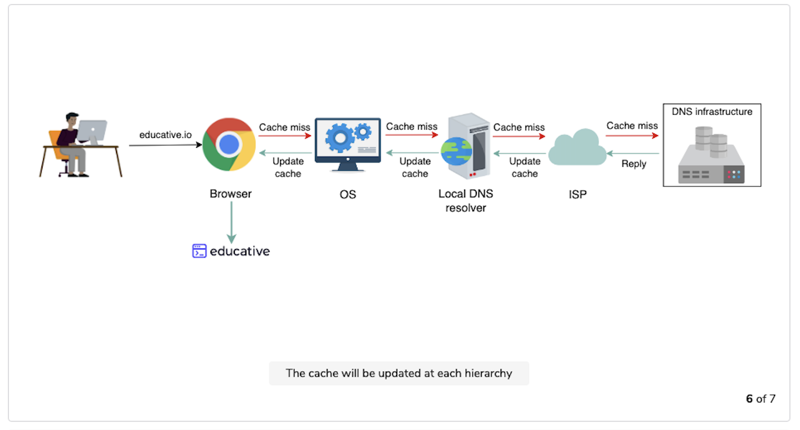
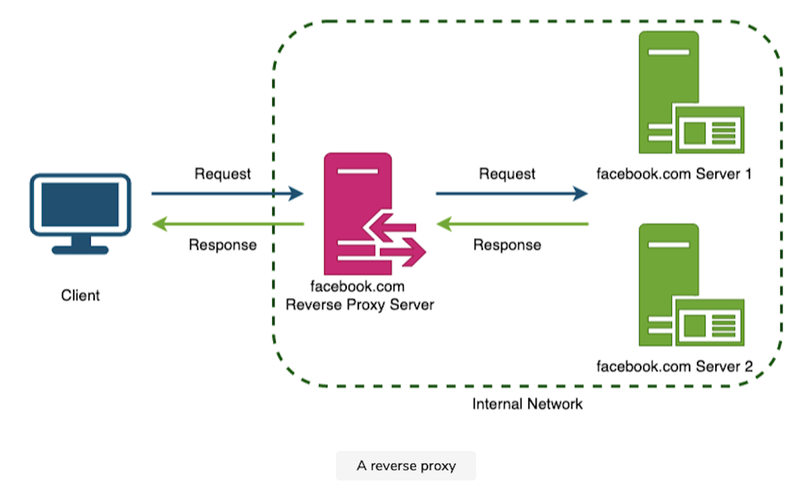
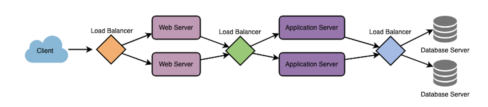
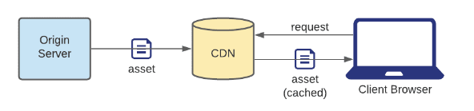
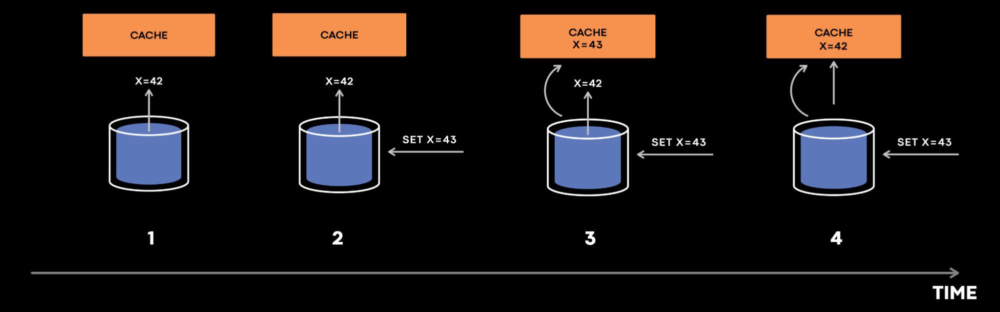
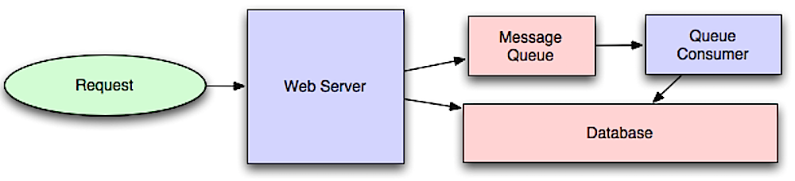

# Domain Name System (DNS)

A `Domain Name System` is a service which helps to translate human-readable path to machine-readable path

# Reverse Proxy

A reverse proxy sits in front of servers to hide the identiy of actual servers. They can also be used for caching, load balancing and request routing.

Using reverse proxy has the following advantages:

- Better security
- Better scalability
- SSL termination
- Session persistence
- Response compression
- Caching
- Serving static content

Common reverse proxies are NGINX and HAProxy.

# Load Balancer

A load balancer sits in front of servers to distribute incoming requests across multiple servers.

There can be multiple load balancers to prevent "single point of failure."

There are multiple methods to forward traffic:
- Least connection
- Least response time
- Least bandwidth
- Round robin
- Weighted round robin
- Client IP hash

# Cache

Cache exists in almost every computing layer. From browsers, application servers to databases. It significantly improves performance by storing the most used data in the storage.

Common application caches are Redis and Memcached.

## Content Delivery/Distribution Network (CDN)

This cache is specifically designed for storing static media, which helps to improve transmission time when it comes to reading content-heavy scenarios.

## Cache Invalidation

Cache invaldation is a process of actively invalidating stale cache when data from the single source of truth mutates.

We have the following ways to combat the issue:

- Write through - data is written to both the cache and the permanent storage.
  - pros - resilient to system failures.
  - cons - high latency for write operations.
- Write around - data is wirtten to the permanent storage.
  - pros - preventing cache being flooded.
  - cons - "cache-miss" causes higher latency. 
- Write back - data is written to the cache.
  - pros - low latency for write operations.
  - cons - prone to system failures.

## Cache Eviction Policies

1. First In First Out
2. Last In First Out
3. Least Recently Used
4. Most Recently Used
5. Least Frequently Used
6. Random Replacement

# Message/Task Queue

We can queue up computation heavy tasks and let works pick them up and process in the background.

- message queues - for job notification. Common message queues are Redis, RabbitMQ.
- task queues - job scheduling. Common task queues are Celery.

# Database

Due to the size of content, please visit [database](./database/README.md).

