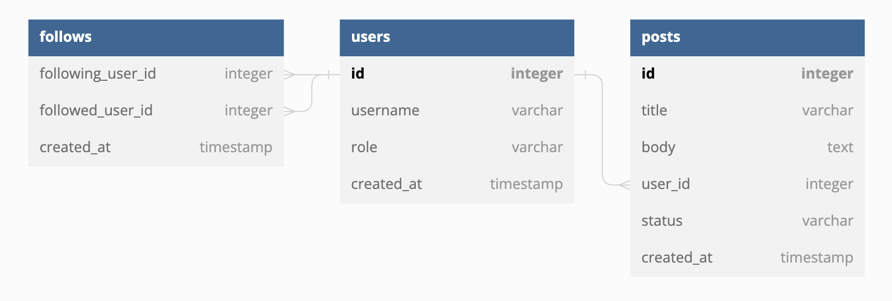
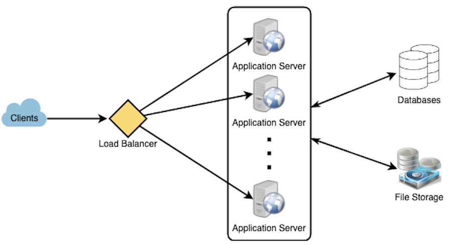

# Step 1 - Clarify Requirements

1. Functional features (fundamental features)
   - For example, Facebook users should be able to share posts.
2. Non-functional features
   - For example, the latency of response should not exceed 200ms.
3. Extended features
   - Only if essential features are covered should we discuss extra features.

# Step 2 - Estimate

1. Estimate the read/write ratio.
2. Calculate the storage capacity.
3. Calculate the bandwidth capacity.

# Step 3 - Define API Interface

Roughly outline the API the system will be using.
```
post(apiKey, userId, userLocation, content, ...)
```
```
markTweetFavourite(userId, tweetId, timestamp, ...)
```

# Step 4 - Database Design



1. Draw the data models. [dbdiagram.io](https://dbdiagram.io/home)
2. Discuss what kind of database we are going to use (SQL vs NoSQL)

# Step 5 - High Level Design



Draw block digram to represent the system.

# Step 6 - Detialed Design

Identify bottlenecks and discuss trade-offs.

Possible common questions
1. Consistency vs Availability?
2. Which components need load balancer?
3. What kind of data partitioning we are going to use?
4. Hom many layers of caches do we need?
5. Any single point of failure spotted?