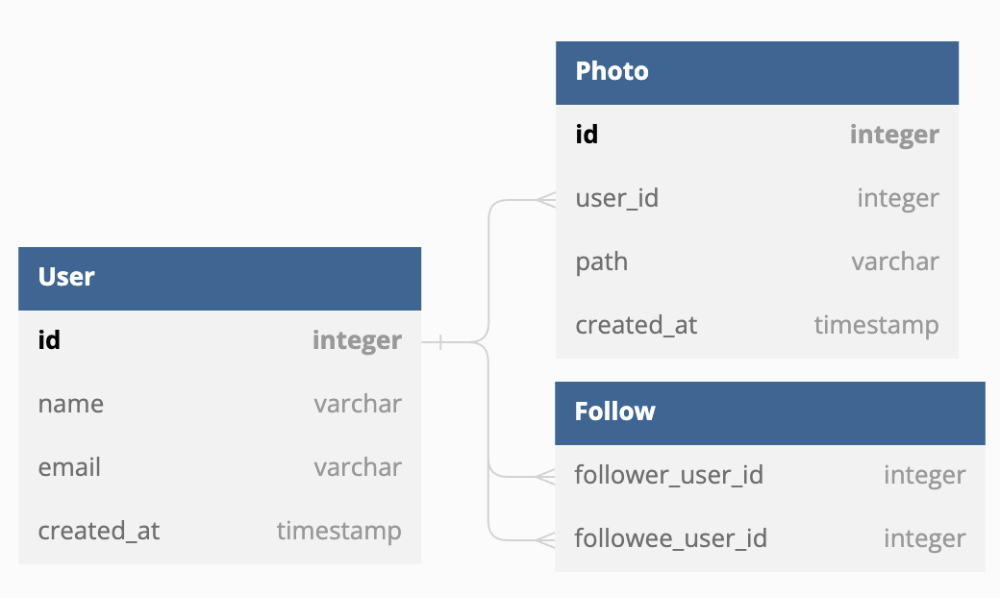
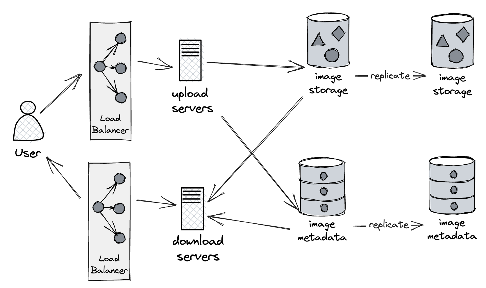

# Step 1 - Clarify Requirements
Functional features
- User can upload/download photos.
- User can search photos based on titles.
- User can follow other users.
- User can see news feed (photos) from people followed by the user.

Non-functional features
- Availability over consistency.
- The latency should be less than 200ms.
- Uploaded photos should never be lost.

# Step 2 - Database Design



- Photos can be stored in file storage like S3.
- We can use either SQL or NoSQL. Each way has its own pros & cons.

# Step 3 - Estimate

Assuming
- 100:1 ratio between read/write.
- The size of a photo is 2 MB.
- 1M photos are created per month.
- 1M * 100 photos are read per month.
- photos should persist at least 5 years.

Traffic estimation
```
1M / (3600 secs * 24 hrs * 30 days) ~= 0.385 QPS for write
1M * 100 (3600 secs * 24 hrs * 30 days) ~= 38.5 QPS for read
```

Bandwidth estimation
```
0.385 * 2048 KB ~= 788 KB/s for write
38.5 * 2048 KB ~= 77 MB/s for read
```

Storage estimation
```
1M * 2 MB * (5 years * 12 months) ~= 114 TB for 5 years
```

Cache estimation
```
77 MB/s * (3600 secs * 24hrs) * 0.2 ~= 12.6 TB per day
```

# Step 4 - High Level Design



- For high availability, we can have multiple upload/download servers to achieve achieve that.
- For reliability, we can have multiple replica stoarges to back up files.

# Step 5 - Detailed Design

1. How to store photos (data sharding)?
   - Partition by user ID
     - Users with lots of photos would make uneven distribution.
     - Storing a user's photos on one shard could lead to unavailability of all of the user's data when one shard is down.
     - Storing a user's photos across multiple shards could cause higher latency.
   - Partition by photo ID
     - All issues metioned above would be solved.
     - We can use key generation service (KGS) to generate photo ID.
2. How to generate news feed?
   - Generating top photos might cause high latency due to intensive computation. To combat this issue, we could have a server to pre-generate the news feed.
3. How to publish news feed?
   - Pull - is good for frequently updated data. Otherwise it might cause empty responses and waste bandwidth.
   - Push - is good for seldom updated data. Otherwise it might burden the server loading.
   - Hybrid - pull for users following lots of people. Push for users following less people.