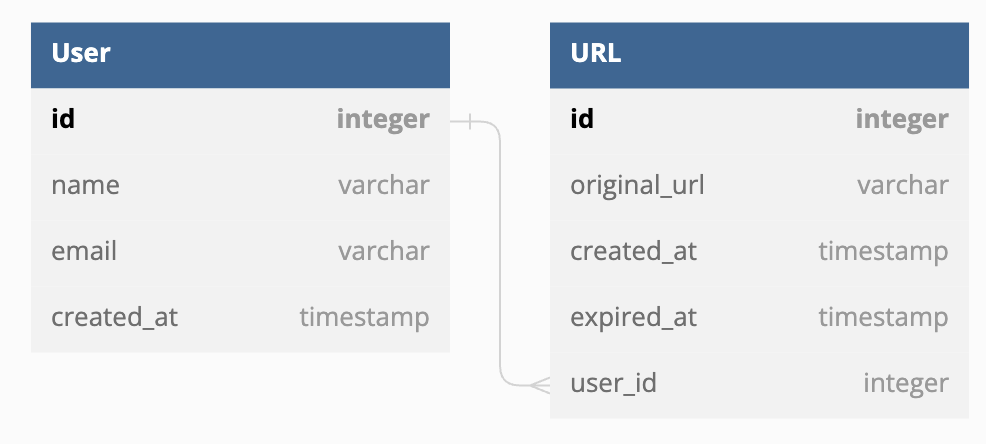
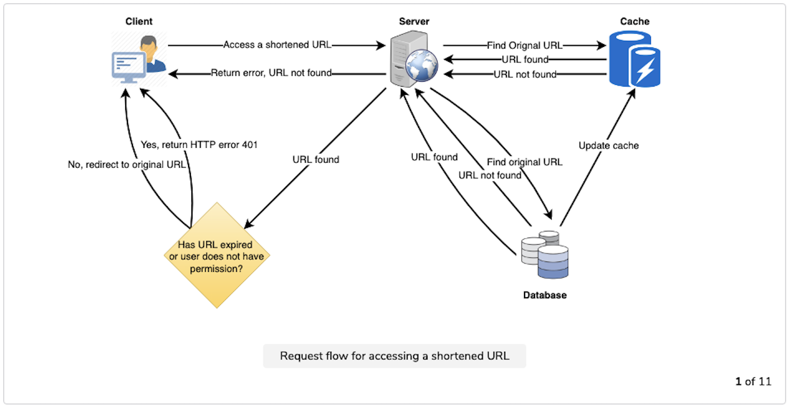

# Step 1 - Clarify Requirements
Functional features
- Given a URL, our service should generate a shorter and unique URL.
- When users access a short URL, they should be redirected to the original link.
- Links can be customized by Users.
- Links can be expired.
- Links can have a custom expiry date specified by users.

Non-functional features
- The system should be highly available.
- Links redirection with minimal latency.
- Shortened links can not be predicatble.

Extended features
- Accessbile with REST APIs by other services.

# Step 2 - Estimate

Assuming the service has the following conditions
- 10:1 ratio between read and write.
- 100k shortened links are written per month.
- 100k * 10 shortened links are redirected per month.
- Shortened links persist for 3 years.
- Each stored URL is 500 kb.

Traffic estimation (QPS, Query Per Second)
```
1000K / (3600 secs * 24 hrs * 30 days) ~= 0.385 QPS for read
100K / (3600 secs * 24 hrs * 30 days) ~= 0.0385 QPS for write
```

Bandwidth estimation
```
0.385 * 500 = 192.5 KB/s for read
0.0385 * 500 = 19.25 KB/s for write
```

Storage estimation
```
100k * 500 kb * (3 years * 12 months) ~= 1.67 TB for 3 years
```

Cache estimation (following 80-20 rules, only 20% of data is hot and worth caching)
```
192.5 KB/s * (3600 secs * 24 hrs) * 0.2 ~= 3.17 GB per day
```

# Step 3 - Define API Interface
```
shortenURL(apiKey, url, username, customURL, expiryDate)
```
- `apiKey` - for identifying developers.
- `url` - the original URL.
- `username` - the username for encoding.
- `customURL` - to specify custom URL.
- `expiryDate` - to specify expiry date.

```
deleteURL(apiKey, urlKey)
```
- `apiKey` - for identifying developers.
- `urlKey` - the key to the URL.

# Step 4 - Database Design

We could use NoSQL due to following observations
- Possible large volume of data.
- Loose record relationships other than links and users.
- Read heavy.



# Step 5 - High Level Design



# Step 6 - Detailed Design

