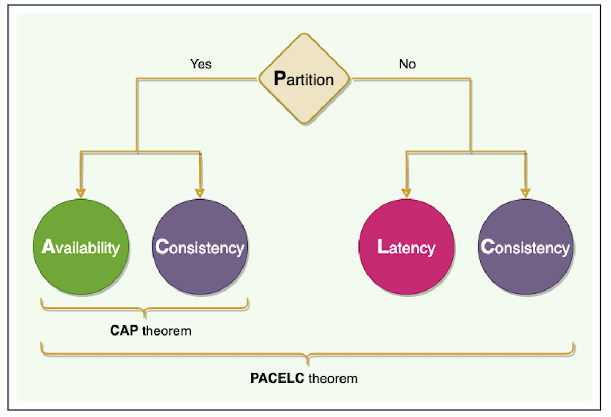
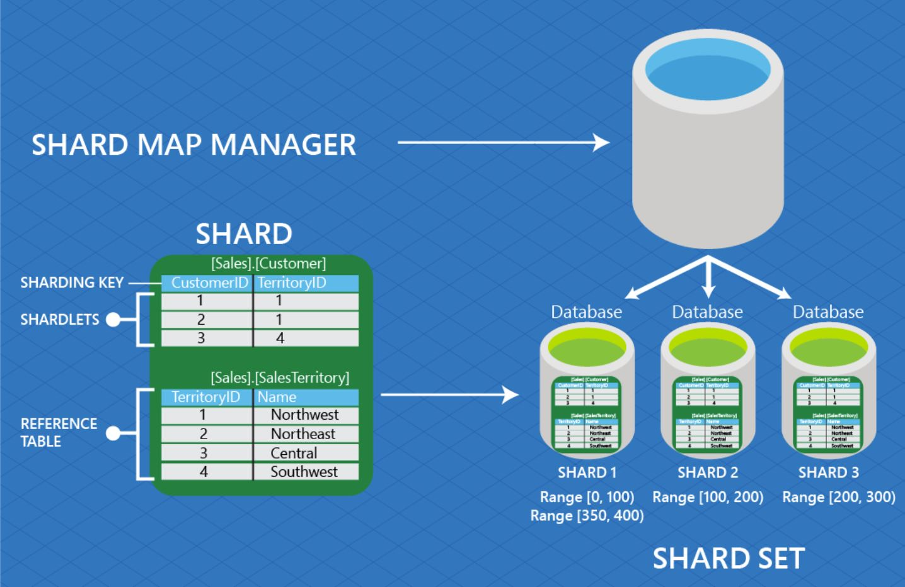

Characteristics of Distributed Systems
===

## Scalability
A capability to continue to grow when facing increasing demand.

- vertical scaling - upgrading hardwares (CPU/RAM/storage... etc.) for a single machine.
- horizontal scaling - adding more machines to a distributed system.

## Reliability
A capability that a service can keep running even though several of its machines or hardware components fail.

## Availability
The uptime of a service.

## Efficiency
The performance of a service. It can be measured with two factors
1. latency - response time
2. throughput - bandwidth

## Managebility (Serviceability)
The difficulty of maintenance (updating, how easy to operate... etc.)

CAP Theorem
===

Generally, a distributed system can only cover two out of three aspects, which are `CA`, `CP` and `AP`. As network parition should be always tolerated, it leaves only `CP` or `AP`.

## Consistency
All nodes have an up-to-date copy of data. Users should be able to see the same data.

## Availability
All requests should have an response, even if there are several failed servers/components.

## Partition Tolerance
A partition is a network failure (communication break) between nodes. The system should continue to operate even with dropping messages.

## CP & AP
- CP - When network partitioning happens, if information cannot be guaranteed to be up to date, the system should respond with an error.
- AP - When network partitioning happens, the system should always respond without guaranteeing up-to-date information.

PACELC Theorem
===

PACELC theorem is to answer an area where the CAP theorem remains silent - what if there is no network partitioning?

When network partition happens, the CAP theorem applies, but in a case where we can maintain high `availability` by data replication, the trade-off between `latency` and `consistency` matters.

For example, MongoDB chooses `PA/EC`, meaning when a network partition happens, it favours `availability`, but otherwise guarantees `consistency` over `latency`.

Data Partitioning
===

## Methods

### 1. Horizontal (data sharding)
Putting different rows into different tables. For example, rows with ZIP code less than 10000 go in table A and ZIP code greater than 10000 go in table B.
- cons - when the partitioning scheme isn't chosen carefully, it might result in unbalanced servers. In the ZIP code example, some areas with high ZIP code density might lead to uneven distributed data.

### 2. Vertical
Sorting tables by servers. For example, if we have an Instagram to build, we can store user profile on server A, friend list on server B and photos on C.
- pros - easy to implement.
- cons - when facing fast growth, we will still need to partition data sooner or later.

### 3. Directory-based
A lookup service that decouples DB relations. To find out a particular DB entity, we first lookup this service to get a key to a particular DB server, and moving forward to that DB server to get the information we need.

## Criteria

1. Key/Hash-based - whenever we want to insert a record, hash the record ID and assign it to a corresponding server.
2. List - whenever we want to insert a record, find out its value and assign it to a corresponding server. For example, we can assign records of users living in countries like Japan, Taiwan and South Korea to a partition specifically for Eastern Asia.
3. Round-Robin - assign the record to servers in turn.
4. Composite - combining any partitioning method we mentioned before.

## Challenges & Problems

1. Query by joining across database servers greatly impacts performance. Though it can be mitigated with a technique `denormalization` (combining multiple tables as one), it comes with the downside of data inconsistency.
2. Maintaining `referential integrity` could be costly, as now we have to update foreign keys on different database servers.
3. Rebalancing the balance between partitions would be a challenge as maintaining implies server downtime. If we don't want downtime, we could use the lookup service (directory-based partitioning) at the expense of increasing complexity and creating a new single point of failure.
